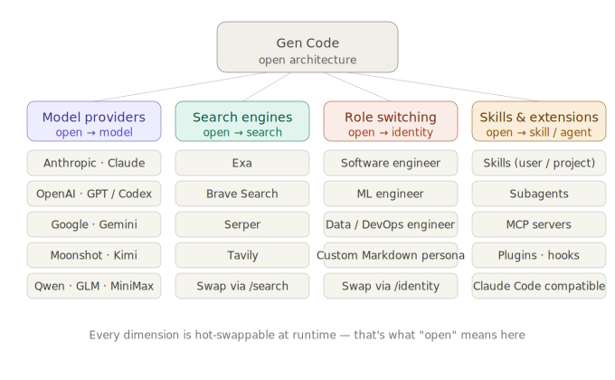

<div align="center">
  <h1>&lt; GEN ✦ /&gt;</h1>
  <p><strong>Open-source AI coding assistant for the terminal</strong></p>
  <p>
    <a href="https://github.com/genai-io/gen-code/releases"></a>
    <a href="https://goreportcard.com/report/github.com/genai-io/gen-code"></a>
    <a href="https://pkg.go.dev/github.com/genai-io/gen-code"></a>
    <a href="LICENSE"></a>
  </p>
</div>

Gen Code is a terminal coding assistant with interchangeable LLM providers, assistant personas, and search engines. Existing [Claude Code](https://claude.ai/code) skills, plugins, and project instructions work unchanged. Implemented in Go as a single binary with concurrent multi-agent orchestration.

## Features

### Open architecture

<p align="center">
  
</p>

- **LLM providers** — Anthropic, OpenAI, Google, Moonshot, Alibaba, MiniMax, Z.ai (GLM); swap via `/model`.
- **Search backends** — Exa, Tavily, Brave, Serper; swap via `/search`.
- **Personas** — Markdown identities scoped to user or project; swap via `/identity` ([details](docs/system-prompt.md#identity-custom-personas)).
- **Skills & extensions** — Claude Code skills, plugins, and MCP servers run unmodified; sandboxed subagents; lifecycle hooks (shell, LLM, agent, HTTP); auto-loaded project memory.

### Engineering

- **Native performance** — Single Go binary; see [benchmark](#benchmark-gencode-vs-claude-code) for measured numbers.
- **Event-driven coordination** — Parallel subagent execution via a pub/sub hub ([architecture](docs/subagent.md)).
- **Session persistence** — Auto-save, resume, fork, and automatic context compaction.
- **Prompt prediction** — Speculative completion of likely next prompts to reduce latency.


## Installation

```bash
curl -fsSL https://raw.githubusercontent.com/genai-io/gen-code/main/install.sh | bash
```

Re-run to upgrade. To uninstall:

```bash
curl -fsSL https://raw.githubusercontent.com/genai-io/gen-code/main/install.sh | bash -s uninstall
```

<details>
<summary><b>Other methods</b></summary>

**Go Install**

```bash
go install github.com/genai-io/gen-code/cmd/gen@latest
```

**Build from Source**

```bash
git clone https://github.com/genai-io/gen-code.git
cd gen-code
go build -o gen ./cmd/gen
mkdir -p ~/.local/bin && mv gen ~/.local/bin/
```

</details>

## Usage

```bash
gen                            # interactive
gen "explain this function"    # one-shot
cat main.go | gen "review"     # piped input
gen --continue                 # resume latest session
gen --resume                   # pick a past session
```

Run `/model` on first launch to connect a provider; `/help` lists all slash commands (`/identity`, `/search`, `/skills`, `/agents`, `/mcp`, `/compact`, `/resume`, …).

Keyboard: `Shift+Tab` permission mode · `Ctrl+O` expand tool details · `Ctrl+C` cancel · `Ctrl+D` exit.

## Configuration

Config lives in `~/.gen/` (user) and `<project>/.gen/` (project, overrides user). A `GEN.md` or `CLAUDE.md` at the project root is auto-loaded into the system prompt.

### Credentials

| Service | Variable |
|:--------|:---------|
| **Anthropic** (Claude) | `ANTHROPIC_API_KEY` or [Vertex AI](https://cloud.google.com/vertex-ai/generative-ai/docs/partner-models/claude) |
| **OpenAI** (GPT, o-series, Codex) | `OPENAI_API_KEY` |
| **Google** (Gemini) | `GOOGLE_API_KEY` |
| **Moonshot** (Kimi) | `MOONSHOT_API_KEY` |
| **Alibaba** (Qwen, DeepSeek) | `DASHSCOPE_API_KEY` |
| **MiniMax** | `MINIMAX_API_KEY` |
| **Z.ai** (GLM) | `BIGMODEL_API_KEY` |
| **Exa** search | _none_ (default) |
| **Tavily** search | `TAVILY_API_KEY` |
| **Brave** search | `BRAVE_API_KEY` |
| **Serper** search | `SERPER_API_KEY` |

<details>
<summary><b>Directory layout</b></summary>

User-level (`~/.gen/`):

```
providers.json    # Provider connections and current model
settings.json     # Permissions, hooks, env, identity
skills.json       # Skill states
identities/       # Custom personas (see /identity)
skills/           # Custom skill definitions
agents/           # Custom agent definitions
commands/         # Custom slash commands
plugins/          # Installed plugins
projects/         # Session transcripts + indexes
```

Project-level (`.gen/`):

```
settings.json      # Permissions, hooks, disabled tools
mcp.json           # MCP server definitions
identities/*.md    # Project-scoped personas (override user-level)
agents/*.md        # Subagent definitions
skills/*/SKILL.md  # Skills
commands/*.md      # Slash commands
```

</details>

## Benchmark: Gen Code vs Claude Code

Compared with [Claude Code](https://claude.ai/code) v2.1.112 on Apple Silicon, same model (`claude-sonnet-4-6`):

| Metric | Gen Code | Claude Code | Advantage |
|--------|---------|-------------|-----------|
| Download size | 12 MB | 63 MB (+ Node.js 112 MB) | **5x smaller** |
| Disk footprint | 38 MB | 175 MB | **4.6x smaller** |
| Startup time | ~0.01s | ~0.20s | **20x faster** |
| Startup memory | ~32 MB | ~189 MB | **5.8x less** |
| Simple task | ~2.4s / 39 MB | ~10.4s / 286 MB | **4.3x faster, 7.3x less memory** |
| Tool-use task | ~3.3s / 39 MB | ~26.0s / 285 MB | **7.9x faster, 7.2x less memory** |

Both tools have comparable features (hooks, skills, plugins, session, MCP, etc.). The performance gap comes from Go's native compilation, minimal architecture design, and lean prompt engineering — vs Node.js V8/JIT/GC runtime overhead.

See full details: [docs/benchmark-gencode-vs-claudecode.md](docs/benchmark-gencode-vs-claudecode.md)

## Documentation

- [Architecture](docs/architecture.md) — TUI MVU model and package layout
- [System Prompt](docs/system-prompt.md) — Slot model, identity, skill/agent injection
- [Subagents](docs/subagent.md) · [Skills](docs/skill-system.md) · [Plugins](docs/plugin-system.md) · [MCP](docs/mcp-servers.md)
- [Hooks](docs/hook.md) · [Permissions](docs/gen-permission.md) · [Tasks](docs/task-management.md)
- Per-feature notes under [`docs/features/`](docs/features/)

## Related Projects

- [Claude Code](https://claude.ai/code) — Anthropic's AI coding assistant
- [Aider](https://github.com/paul-gauthier/aider) — AI pair programming in terminal
- [Continue](https://github.com/continuedev/continue) — Open-source AI code assistant

## Contributing

Contributions welcome! See [CONTRIBUTING.md](CONTRIBUTING.md) for guidelines.

## License

Apache License 2.0 - see [LICENSE](LICENSE) for details.