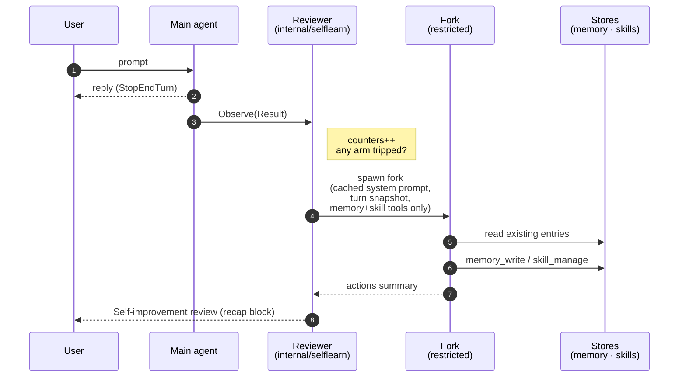
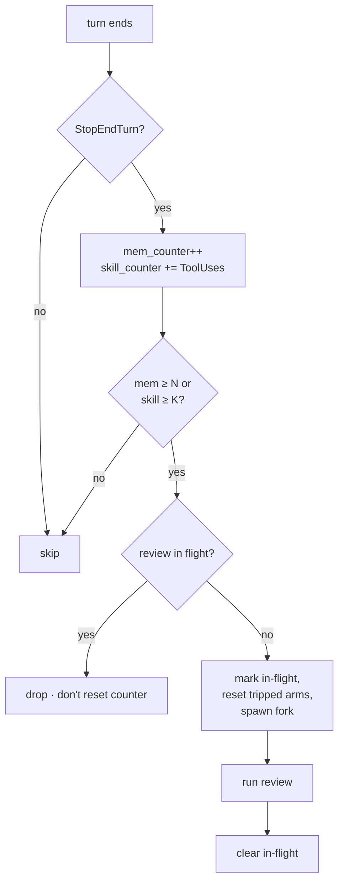
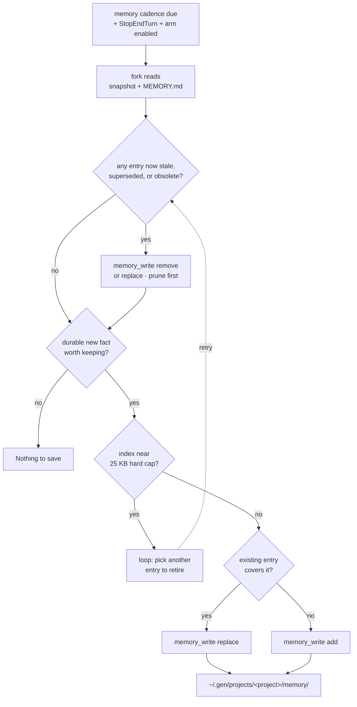
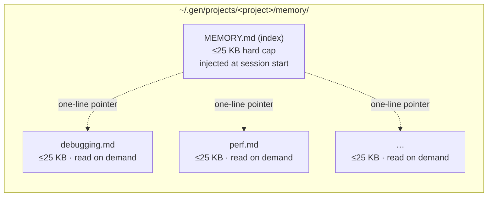
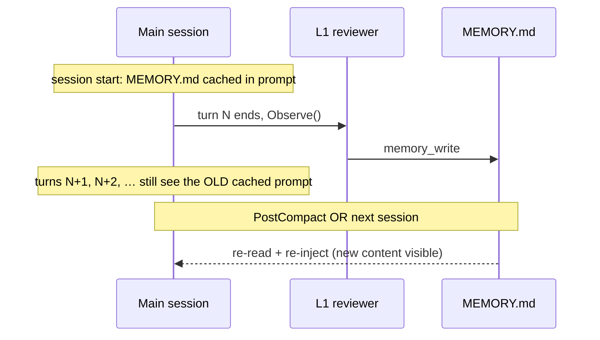
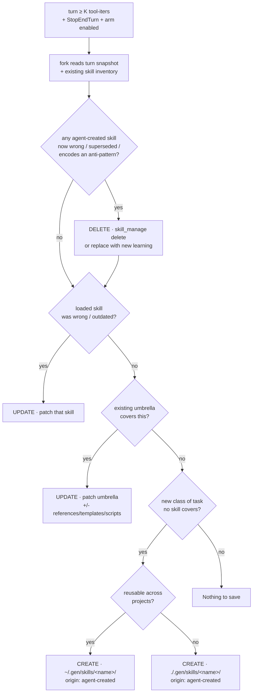

# L1 — Background Review (per-turn self-learning)

Layer 1 of the self-learning loop in [#46](https://github.com/genai-io/gen-code/issues/46).
This is [#52](https://github.com/genai-io/gen-code/issues/52).

**Contents.** [§0 Overview](#0-what-l1-is-and-the-problems-it-solves) · [§1 Compare](#1-three-systems-compared) · [§2 Architecture](#2-architecture) · [§3 Trigger](#3-trigger--two-arms) · [§4 Memory](#4-memory-flow) · [§5 Skill](#5-skill-flow) · [§6 Fork & UI](#6-fork-mechanics--invariants) · [§7 Filesystem](#7-filesystem-layout) · [§8 L1 vs L2](#8-l1-vs-l2--where-grooming-lives) · [§9 Phasing](#9-phasing--next-steps) · [§10 Open questions](#10-open-questions)

---

## 0. What L1 is, and the problems it solves

### What it is

L1 is a **background reviewer** that runs after each clean turn in its own
forked agent. It reads the just-completed conversation and writes directly
to two stores:

- **Auto-memory** — per-project durable facts (user preferences, project
  conventions, recurring context). Stored at
  `~/.gen/projects/<project>/memory/`; injected into the system prompt of
  every future session.
- **Skill library** — class-level techniques marked
  `origin: agent-created`, living alongside user-authored skills in
  `~/.gen/skills/` (user-wide) and `./.gen/skills/` (project). Loaded the
  same way user skills already are.

The reviewer is **best-effort, out-of-band, eviction-first**: it never
blocks the user's turn; it retires stale entries before adding new ones;
every action is gated by config (§5.5). At most one review is in flight per
session; failures never affect the user reply.

### Problems L1 solves

| Symptom today (without L1) | What L1 changes |
|---|---|
| Every session starts at zero. User re-explains preferences, working style, and project conventions each time. | Reviewer captures durable user/project facts; future sessions start already knowing them. |
| Skills get used but their mistakes never get fixed. Same mistake repeats across sessions. | Reviewer patches a skill the conversation just proved wrong, incomplete, or outdated (§5.1). |
| Skills accumulate but never retire. Obsolete entries pile up and mislead later sessions. | Reviewer deletes a skill in the same pass that learned its replacement (§5.1). |
| Non-trivial fixes, debug paths, and tool-usage patterns evaporate at session end. | Generalizable learnings captured as class-level skills; level (user vs project) chosen by reusability. |
| `GEN.md` / `CLAUDE.md` only grows if the user hand-curates it. | A separate auto-memory store grows alongside, machine-local and project-partitioned (§4) — never mixed with the user-authored instructions. |

### What L1 deliberately does not do

- **No cross-collection grooming.** L1 sees one turn at a time.
  Whole-library dedup, contradiction resolution, and usage-based
  retirement is L2's job (§8) — deferred to a separate issue.
- **No approval prompts.** L1 writes directly, gated by config rather
  than by interrupts. Default is opt-in (off); permission defaults stay
  conservative once on.
- **No touch on user-authored content**, unless `allowUpdateUserCreated`
  is explicitly enabled (§5.5). Even then, only `patch` —
  create/delete on user-created skills are impossible at any setting.
- **No live patching of the running session.** Writes become visible at
  the next memory load (PostCompact or new session, §4.6). Live-patching
  would invalidate the prefix cache.

---

## 1. Three systems compared

| Axis | Hermes (`background_review.py`) | Claude Code (auto memory) | gen-code L1 (this doc) |
|---|---|---|---|
| Where the write decision lives | **Out-of-band** fork | **In-band** main agent | **Out-of-band** (Hermes-aligned) |
| When | After a clean turn | Mid-turn, on model judgment | After a clean turn |
| Writes directly | yes (fork has memory + skill tools) | yes (main agent's own tool) | yes |
| Trigger signals | turns (memory) + tool-iters (skill) | model judgment + explicit "remember this" | **turns + tool-iters** |
| Memory scope | **global** `~/.hermes/MEMORY.md` + `USER.md` | **per-project** `~/.claude/projects/<repo>/memory/` (index + topic files) | **per-project** `~/.gen/projects/<project>/memory/` (Claude-Code-aligned) |
| Skill scope | global, with provenance flags | global, with provenance | **user + project**, `origin: agent-created` field |
| Eviction policy | review prompt steers retire; L2 curator does deep grooming | in-band agent prunes stale entries to stay under index cap | review prompt steers **retire + replace before add**; on-disk cap ≡ inject cap (25 KB); L2 deferred for deep grooming |
| Cache parity | inherits cached system prompt verbatim (≈26% cost cut measured) | n/a (no fork) | inherits verbatim |

**Why this mix.** Hermes' out-of-band shape is the production-proven one (best
turn responsiveness, dedicated reviewer prompt, no main-context bloat); Claude
Code's per-project memory layout is the right home for gen-code's multi-repo
users (worktrees of one repo share a store; different repos don't leak into
each other). gen-code already has the **read/injection side** (memory loads
+ `<system-reminder>` re-emit on PostCompact); L1 only adds the **write side**.

---

## 2. Architecture



Key points the diagram encodes:

- The reviewer is **fed** completed turns (single-consumer outbox is already
  drained by the app); it doesn't subscribe.
- The fork's read side reads current memory + lists existing skills so it can
  pick **update over create** and **replace over append**.
- The user-visible surface is a single line per fork — silent on "Nothing to
  save."

---

## 3. Trigger — two arms



| Arm | Signal | Default | Why this signal |
|---|---|---|---|
| Memory | user turns since last review | every **10** user turns | User-modelling drifts on conversational cadence, not work intensity. |
| Skills | **accumulated** tool iterations **since last skill review** | total ≥ **10** tool-iters since last review | Skill capture should fire after meaningful cumulative work; tool-iters is a cheap, provider-agnostic proxy (tokens are per-provider and post-hoc). |

Both arms count independently and may fire on the same turn (combined prompt).
Counters live in the reviewer and **hydrate from history on session resume**
(memory only — the skill counter is intra-turn).

### 3.1 Configuration

Settings live under `selfLearn` in `settings.json`, merged across user /
project / local layers like other gen-code settings.

```json
{
  "selfLearn": {
    "memory": {
      "enabled": false,
      "everyTurns": 10,
      "maxKB": 25
    },
    "skills": {
      "enabled": false,
      "everyToolIters": 10,
      "denyCreate": false,
      "denyUpdate": false,
      "denyDelete": false,
      "allowUpdateUserCreated": false
    }
  }
}
```

**Fields.**

| Field | Default | Meaning |
|---|---|---|
| `memory.enabled` / `skills.enabled` | `false` | Independently toggle each arm. Both off ⇒ no reviewer goroutine, zero overhead. |
| `memory.everyTurns` | 10 | Memory cadence in user turns. |
| `memory.maxKB` | 25 | Hard cap on every memory file. Default = injection cap; lower values force more aggressive pruning. May not exceed 25 (would break the §4.2 invariant). 1 KB ≈ 180 EN words ≈ 340 中文字 (UTF-8). |
| `skills.everyToolIters` | 10 | Cumulative tool-iters since last skill review (§3 table). |
| `skills.denyCreate` | `false` | Zero ⇒ L1 may create new agent-created skills. Set true to disable creation. |
| `skills.denyUpdate` | `false` | Zero ⇒ L1 may patch existing agent-created skills. Set true to disable updates. |
| `skills.denyDelete` | `false` | Zero ⇒ L1 may delete agent-created skills (never user-created). Set true to disable deletion. |
| `skills.allowUpdateUserCreated` | `false` | Advanced opt-in: extends update to also patch user-created skills (§5.5). |

The `denyX` encoding inverts the polarity so the zero value is the safe
permissive default (Go idiom — "zero value should be sensible"). Every
omitted field reads as "allow"; setting true is the explicit lockdown.

**Startup validation** rejects two illegal combinations:

| Rejected | Reason |
|---|---|
| `denyCreate=false, denyUpdate=true` | Created skills could never be refined → unfixable errors accumulate. |
| `allowUpdateUserCreated=true, denyUpdate=true` | Depends on the update permission; combination is meaningless. |

`denyDelete=true` with create + update allowed is **permitted** — "create and
refine my own skills but never auto-delete them" is a legitimate conservative
config (delete is already restricted to agent-created skills, so opting out of
it removes no safety).

**Default off (opt-in).** L1 forks an extra model call per cadence and writes
files automatically; ship opt-in, default-on later once trusted.

**Env override.** `GEN_DISABLE_SELF_LEARN=1` disables everything regardless of
config, mirroring Claude Code's `CLAUDE_CODE_DISABLE_AUTO_MEMORY`.

---

## 4. Memory flow

### 4.1 Decision flow — addition AND subtraction

L1 is **not only allowed to remove — it is required to**. Claude Code's
in-band agent keeps its index lean by pruning expired info before the cap
forces a truncation; gen-code's out-of-band reviewer inherits that policy by
prompt. Every review pass scans the existing index first and retires stale,
superseded, or merged-PR-specific entries **before** considering new
additions. A pass that only adds is a missed pruning opportunity.



**Tool actions:** `add` / `replace` / `remove`. "Nothing to save." is a valid
outcome — but a pass that does **only** add (no retirement of anything) is
flagged in the prompt as suspect.

**Anti-patterns (don't save):** one-off task state, transient errors,
"what-we-did-this-session" narratives — none are durable across sessions.

### 4.2 Size budgets

| What | Cap | Source | At cap |
|---|---|---|---|
| Single memory file on disk (index or topic) | **`memory.maxKB`** (default 25 KB, user-lowerable per §3.1) | `internal/selflearn/memory.go memoryFileCharLimit` | `memory_write add/replace` returns an error; reviewer must prune first |
| `MEMORY.md` injected into system prompt | **25 KB** — matches Claude Code | `internal/core/system/memory.go autoMemoryByteCap` | Truncated on a line boundary |
| Topic file count | unbounded (see §10) | — | Review prompt biases toward consolidation |

**Invariant.** `memory.maxKB ≤ 25 KB` is enforced at config load. So the
on-disk per-file cap is always ≤ the injection cap, and L1 never produces a
file the loader has to truncate.

**Capacity reference.**

| `maxKB` | ≈ EN words | ≈ 中文字 (UTF-8) | Feel |
|---|---|---|---|
| 5 | 900 | 1 700 | short note |
| 10 | 1 800 | 3 400 | short blog post |
| 15 | 2 700 | 5 100 | long blog post |
| 25 *(default)* | 4 500 | 8 500 | short report |

### 4.3 Store anatomy



The **index** is always injected (capped at 25 KB). **Topic files** are read
on demand by the agent's file tools when the index pointer is dereferenced;
they don't pay the prompt budget on their own, but their *count* can drift
upward — handled by §10 / L2.

### 4.4 Store layout

`~/.gen/projects/<project>/memory/MEMORY.md` is the index; long detail spills
into topic files (`debugging.md`, …) loaded on demand. `<project>` is the
git-repo root path with `/` → `-` (Claude Code's encoding, e.g.
`-Users-me-work-gen-code`), so worktrees of one repo share a store; fall back
to cwd outside a repo. User-level + project-partitioned is **machine-local,
out of the repo** — no commit/gitignore decision, no agent churn in git
history.

### 4.5 Injection lifecycle (reuses existing infrastructure)

| When | What happens |
|---|---|
| Session start | Read `MEMORY.md` index → inject as `<system-reminder source="memory-auto">` on first user message. Topic files are read on demand by file tools, not injected. |
| PostCompact | Re-read from disk + re-emit reminders (same path as `GEN.md` / `CLAUDE.md`). |
| cwd change | Re-read, because `<project>` changes. |

This requires one small read-side change: extend `LoadMemoryFiles` with a new,
**distinct "auto" source** so agent-written memory and user-authored
`GEN.md` / `CLAUDE.md` never mix. Without this read side, L1 writes would
never be injected.

### 4.6 Write→visibility lag (by design)

L1 writes out-of-band; the running session's memory was injected at a load
point, so a fresh write becomes visible at the **next** load point — not
live-patched.



Acceptable: memory primarily serves future turns / sessions, not the very
turn that produced the learning. Live-patching would invalidate the prefix
cache and waste the parity savings from §6 invariant #2.

---

## 5. Skill flow

> **Umbrella** = a broad, **class-level** skill (e.g. `go-testing`,
> `code-review`) that accumulates many learnings over time, as opposed to a
> **narrow, session-specific** skill (`fix-flaky-test-pr-1234`). It is a
> naming convention, not a stored field — the flow prefers extending an
> umbrella over spawning narrow skills so the library stays "broad and few".

### 5.0 Trigger layers

Three independent layers gate every skill action:

| Layer | Decides | Where |
|---|---|---|
| **Cadence** | Whether *any* review pass runs at all | `Reviewer.Observe`: `itersSinceSkill >= everyToolIters` (§3) |
| **Semantic** | Which action (create / update / delete) and on which target | Review prompt + model judgment, against §5.1 flow |
| **Permission** | Final allow / deny of each tool call | `skill_manage` dispatch checks `denyCreate / denyUpdate / denyDelete` (§5.5) |

Cadence triggers a pass; semantic decides what to attempt; permission can
veto each tool call. The review prompt is assembled per-config so the model
doesn't waste turns proposing forbidden actions — but the permission layer
remains the hard floor.

### 5.1 Decision flow — UPDATE / DELETE / CREATE

L1 must **retire**, not only add. A skill the conversation just proved wrong,
superseded, or obsolete is deleted in the same review pass that learned the
replacement; otherwise the library grows monotonically and drifts toward
narrow, overlapping noise. Usage-based retirement (skills nobody invokes any
more) is L2's job — but in-pass "this skill is wrong, kill it" lives at L1.



**Trigger conditions per action.** Within a review pass, the model picks an
action only when the semantic conditions below hold. The permission layer
(§5.5) then allows or vetoes each dispatch.

| Action | Semantic triggers | Permission · Allowed targets |
|---|---|---|
| **CREATE** | **All four:** ① turn produced a non-trivial, generalizable technique / fix / pattern; ② **no** existing skill (agent OR user) covers this class; ③ name is class-level (`go-table-tests` ✅, `fix-pr-1234` ❌); ④ not an anti-pattern (env-dependent failure, tool negative claim, transient error, one-off narrative). | `denyCreate=false` · `agent-created` only |
| **UPDATE** | **Any one:** ① a skill loaded / consulted this turn was proven wrong / incomplete / outdated; ② an existing umbrella skill covers the new learning; ③ user voiced a style / format / workflow correction that belongs in the skill governing that task. | `denyUpdate=false` · `agent-created`, plus `user-created` iff `allowUpdateUserCreated=true` |
| **DELETE** | **Any one:** ① superseded wholesale — the new learning replaces the entire skill; ② transient / environment-dependent failure the skill encoded is now resolved (skill is now wrong); ③ skill turned out to encode an anti-pattern. | `denyDelete=false` · `agent-created` only (no config opens user-created) |

A single pass may chain multiple actions (e.g. delete one obsolete + patch
one umbrella + create one new); each is independently evaluated. The
preference order is **UPDATE > DELETE > CREATE** — keeps the library broad
and avoids near-duplicates.

**Tool surface per action.** UPDATE uses `skill_manage(patch, …)` to
fix/extend, or `skill_manage(write_file, …)` to add a `references/` /
`templates/` / `scripts/` support file (plus a pointer line in `SKILL.md`).
DELETE uses `skill_manage(delete, name)`. CREATE uses
`skill_manage(create, name, content, level)` where the **level**
(`~/.gen/skills/` user-wide vs `./.gen/skills/` project) follows the
diagram's *reusable across projects?* branch.

### 5.2 Provenance and L1 write scope

**Provenance is a frontmatter field, not a directory.** Add
`origin: agent-created` to `SKILL.md`; absent ⇒ `user-created`. The `Skill`
struct grows one field (`Origin string`). Skills live directly in gen-code's
existing two scopes — no `agent-created/` subdir, no loader change.

**Scope of L1 writes.** By default L1 creates / patches / **deletes** only
`origin: agent-created` skills. It reads user-created skills (to avoid
duplication) but never modifies or deletes them. The single exception is the
advanced opt-in `allowUpdateUserCreated` (§5.5), which extends `patch` to
user-created — create and delete on user-created **remain impossible at any
config setting**.

### 5.3 Tool surface

`skill_manage` actions: `create`, `edit` (full rewrite — rare), `patch`,
`write_file`, `remove_file`, `delete`. **`patch`** is targeted
find-and-replace with a fuzzy-match chain (exact → line-trimmed → whitespace/
indent/escape/unicode-normalized → block-anchor → context-similarity) and an
**escape-drift guard** (rejects matches where transport-added `\'` / `\"`
backslashes don't exist in the file).

### 5.4 Soft size budget (prompt-enforced)

Unlike memory, skills have **no hard byte cap in code** — a per-skill or
total-count cap would be arbitrary. L1 enforces shape through the review
prompt's preference order; the hard guarantee against drift comes from L2.

| What | Bound | Mechanism |
|---|---|---|
| Single skill body (`SKILL.md`) | none in code | Prompt: keep at class level; factor session-specific detail into `references/` |
| Number of agent-created skills | none in code | Prompt: preference is **UPDATE > DELETE > CREATE**; CREATE is last resort |
| Support files per skill | none in code | Prompt: consolidate when topics overlap |

**Three review prompts**, picked by which arms fired (memory / skill /
combined). The skill prompt is **active** (most working sessions produce ≥1
update or retirement) and embeds the anti-pattern list.

### 5.5 Action permissions

Three Deny-encoded booleans + one advanced opt-in (see §3.1) control what
L1 may do. The first three operate **only on `origin: agent-created`**
skills.

Meaningful combinations (showing the effective Allow permissions; the
config-side fields are the negation, so all-zero = all-allowed = the
default row):

| `create` | `update` | `delete` | What L1 does |
|---|---|---|---|
| ✅ | ✅ | ✅ | *Default* (all `denyX` zero). Grows and maintains its own subset. |
| ❌ | ✅ | ✅ | `denyCreate=true`. Freezes the set; only refines and prunes. |
| ❌ | ✅ | ❌ | `denyCreate=true, denyDelete=true`. Most conservative; only patches existing. |
| ❌ | ❌ | ❌ | All three `denyX=true`. Equivalent to `enabled: false`. |

Of the 8 boolean tuples: 4 meaningful, 2 rejected at startup (§3.1), 2 no-ops.

**`allowUpdateUserCreated`** is the single door that lets `allowUpdate`
extend to user-created skills (Hermes-style "patch the skill just used"). It
is off by default; turning it on rewrites user-authored files when warranted
by the §5.1 flow.

**Prompt synthesis.** Disallowed actions are stripped from the review prompt
so the model doesn't propose them. `allowUpdateUserCreated=true` swaps in
"patch any loaded skill including user-authored" as the top preference.

---

## 6. Fork mechanics — invariants

Fresh `core.Agent` (`core.NewAgent`) in a goroutine, **not**
`subagent.Executor` (which carries registry / hooks / session-persistence a
silent reviewer must not). The fork inherits the parent's `system.System`
verbatim, is seeded with `SetMessages(snapshot)` + a user message carrying
the review prompt, then runs `ThinkAct` under `MaxTurns ≈ 16` and a context
deadline (≈ 5 min).

Eight invariants, each one cost Hermes a production bug:

1. **Run AFTER the user reply is delivered.** Gate on
   `Result.StopReason == StopEndTurn` (skip cancelled / interrupted / max-turns).
2. **Inherit the parent's cached system prompt byte-for-byte** for prefix-cache
   parity (≈26% cost cut on Sonnet 4.5 per Hermes).
3. **Toolset whitelist at dispatch.** `tools[]` matches the parent (cache-key
   parity); a static permission func allows only the **memory + skill
   toolsets** (read *and* write — needs read for dedupe). All else denied.
   Within `skill_manage`, individual actions are **further gated** by the
   §5.5 boolean permissions.
4. **Static `tool.WithPermission` only** — never `agent.PermissionBridge`
   (would deadlock the TUI). Approvals auto-deny.
5. **Best-effort.** Wrap in `recover`; review failure never affects the user
   turn.
6. **No session-scoped side effects** (no hooks, no session persistence).
7. **Suppress fork status.** Fork's internal events stay private; the only
   thing reaching the main outbox is the delimiter-bounded recap defined in
   §"User-visible surface" (`MessageEvent`, `From: "l1-review"`), plus the
   live status-bar tail. Silent on "Nothing to save."
8. **≤1 in-flight fork per session.** Drop new triggers while one runs (log,
   no queue). Counters are **not** reset on drop — the threshold stays
   tripped and re-fires next clean turn.

### Module map

| Concern | Module |
|---|---|
| Trigger + fork | new `internal/selflearn` (observes completed turns, owns counters) |
| Wire-up | `internal/agent/session.go::Task.Start` (start), `stopLocked` (tear down) |
| Fork | `core.NewAgent` directly, restricted `core.Tools` |
| System prompt | pass the parent's `system.System` verbatim |
| Writes | `memory_write` → `~/.gen/projects/<project>/memory/`; `skill_manage` → `~/.gen/skills/<name>/` (user) or `./.gen/skills/<name>/` (project), with `origin: agent-created` |
| Provenance | add `Origin` to skill frontmatter struct (`internal/skill/types.go`); absent ⇒ `user-created` |
| Injection read | memory: extend `LoadMemoryFiles` with a new "auto" source. Skills: no change (existing user/project loader covers it). |

### User-visible surface

Three places the user encounters self-learning.

**Settings — `/config` Self-Learning panel.** `/config` opens a multi-panel
settings page (left sidebar + right pane); Self-Learning is one panel among
others (Provider, Permissions, Appearance, …). The panel groups §3.1
config into two sections (Memory / Skills) with checkboxes for the three
skill permissions; `allowUpdateUserCreated` lives under a collapsed
**Advanced** with a ⚠ "rewrites your authored files" caption.

Panel rules:
- Sub-fields grey out while the section's `enabled` is off.
- `maxKB` field shows live equivalence: `⟨25⟩ ≈ 4500 EN words / 8500 中文字`.
- Illegal config combinations (§3.1) surface as inline warnings; save is
  disabled until resolved.
- Panels with unsaved changes get a `•` marker in the sidebar.

**Runtime — status bar.** Hidden while idle. Surfaces only during an active
review or the brief post-completion window. Label is single-word `evolving`
(gerund — echoes the project theme); a braille spinner conveys activity;
the target name comes from the fork's most recent tool call.

| State | Status bar shows | Duration |
|---|---|---|
| Idle / disabled | — | hidden |
| Review just started | `evolving ⠋` | until first tool call |
| Fork called `skill_manage(name=X)` | `evolving ⠋ X` | until next tool call (debounce ≥ 400 ms) |
| Fork called `memory_write(file="t.md")` | `evolving ⠋ memory · t` | same |
| Review done | `evolved · N changes` | 2 s, then hide |
| Failed / timed out | `evolving failed` | 3 s, then hide |

No emoji; the spinner is structural Unicode, the label is text. Skill
actions show the name directly (no `creating/deleting` prefix — "evolving"
already conveys the verb); memory actions are `memory` or `memory · <topic>`.

**Completion — in-stream summary.** After each successful review pass, the
main outbox surfaces a delimiter-bounded block (`MessageEvent`,
`From: "l1-review"`):

```
─────────────────────────────────────────────────
Self-improvement review
  · updated skill   go-testing      (added flaky-test guidance)
  · saved memory    "user prefers concise output"
  · retired skill   outdated-migrate-tool
─────────────────────────────────────────────────
```

Silent on "Nothing to save." The status bar is the live tail; this block is
the recap — two layers, distinct purposes.

---

## 7. Filesystem layout

```
# Skills (existing scopes, distinguished by origin)
~/.gen/skills/<name>/
├── SKILL.md            origin: agent-created | user-created
├── references/         session-specific detail, condensed knowledge banks
├── templates/          starter files meant to be copied
└── scripts/            re-runnable actions (verification, fixtures)

./.gen/skills/<name>/   project-level (same layout)

# Memory (new "auto" source, machine-local, per-project)
~/.gen/projects/<encoded-cwd>/memory/
├── MEMORY.md           index, ≤25 KB on disk and injected (caps match)
├── debugging.md        topic file, read on demand
└── ...
```

---

## 8. L1 vs L2 — where grooming lives

L1 already does **in-pass retirement** (§4.1 / §5.1): retire stale memory
entries before adding, delete an obsolete skill when its replacement is
learned, prune to fit when the 25 KB hard cap is near. That is the floor —
without it L1 would be a pure accumulator.

What L1 **cannot** do well from its local view:

| Drift symptom | Why L1 misses it | L2's basis |
|---|---|---|
| Two skills overlap (different sessions wrote each) | L1 sees one turn at a time | Whole-collection scan |
| A skill nobody invokes any more | L1 has no usage signal | Usage telemetry |
| Two memory facts contradict, written months apart | L1 doesn't re-evaluate past entries | Idle full pass |
| Topic-file count creeping up | L1 only judges per-write | Idle full pass |
| `MEMORY.md` slowly approaching cap from many small adds | L1's per-pass prune is local | Idle full pass |

A separate, idle-triggered **L2 curator** evaluates the whole collection and
dedups / consolidates / archives — the role Hermes' `agent/curator.py` plays.
Its evaluation basis (usage telemetry + collection intrinsics) and trigger
policy are out of scope here and tracked in a separate L2 issue.

**L1-side implication worth flagging now:** L2's strongest signal will be
**usage** (which skill was used when), which gen-code doesn't record today.
A light usage log can land with L1 or just before L2 — flagged so it isn't
forgotten.

---

## 9. Phasing + next steps

**Phase 1 (this issue, #52)** — Trigger + fork + direct memory/skill writes
+ three review prompts.

Prereqs:
- `skill_manage` tool with patch semantics.
- A first-class memory writer to `~/.gen/projects/<project>/memory/`.
- **Injection read side**: extend `LoadMemoryFiles` to load that store as a
  new, distinct "auto" source (§4) — without this, L1 writes are never injected.

Concrete steps:
1. New package `internal/selflearn`: `Reviewer` (counters + observation +
   trigger), `forkAgent(parent, snapshot, mode)` (restricted `core.Agent`,
   runs `ThinkAct`, surfaces one-line summary).
2. `memory_write` + `skill_manage` tools; extend `LoadMemoryFiles` for the
   "auto" source.
3. Review prompt templates (memory / skill / combined) rewritten for gen-code
   terminology.
4. Add the `selfLearn` settings section (§3.1); wire-up in `Task.Start` /
   `stopLocked` — start the reviewer only when ≥1 arm is enabled, pass enabled
   arms + intervals; gate reviews on `StopEndTurn`.
5. Concurrency cap ≤1; drop-and-log on overlap.
6. Tests: trigger cadence (turns / iters / combined), interrupted-turn skip,
   concurrency cap, restricted-toolset enforcement, **permission gate** (each
   legal §5.5 combination behaves as expected; the three illegal combinations
   from §3.1 are rejected at startup; `allowUpdateUserCreated` toggle).

**Phase 2 — L2 curator** (separate issue). Deferred; see §8.

---

## 10. Open questions

- **User-level auto-memory?** Hermes has `USER.md` (global) alongside
  `MEMORY.md`; Claude Code has user-level `~/.claude/CLAUDE.md` alongside
  project `CLAUDE.md`. gen-code L1 currently writes only to project-partitioned
  memory, so cross-project user persona ("I prefer terse output") would be
  re-learned per repo. Options: (a) accept and let the user curate
  `~/.gen/GEN.md` by hand; (b) extend L1 to choose user vs project level,
  mirroring how skills already do. Recommend (b) once Phase 1 is stable.
- **Topic-file count is unbounded.** Per-file cap (25 KB) bounds size but
  not count — the reviewer can keep creating new topics indefinitely. L1's
  review prompt biases toward consolidation, but only L2's idle full pass
  can reliably retire orphans. Acceptable for Phase 1; tracked for L2.
- **Skill body and skill count have no hard caps in code** (§5.4). L1
  enforces shape by prompt (UPDATE > DELETE > CREATE, class-level naming);
  the hard guarantee against drift comes from L2 using usage telemetry to
  retire what nobody invokes.
- **Commit agent-created project skills?** They live in-repo at
  `./.gen/skills/` mixed with user skills (distinguished by `origin`). Team
  choice whether to commit auto-generated ones; can be filtered by `origin`.
- **Cache parity on non-Anthropic providers** — verify system-prompt
  inheritance helps (or at least doesn't hurt) across gen-code's providers.
- **Usage telemetry** — whether to land the minimal usage log in this phase
  (for the future L2) or defer it entirely.

---

## References

- Hermes L1: `agent/background_review.py` (fork, prompts, direct writes);
  triggers in `agent/conversation_loop.py` (memory `:387–394`, skill
  `:4046–4051`, guard `:4062`). L2 (for context): `agent/curator.py`.
- Claude Code memory model: <https://code.claude.com/docs/en/memory>.
- gen-code turn loop & outbox: `internal/core/agent_impl.go`.
- gen-code injection side (built): `internal/reminder` providers, PostCompact re-emit.
- Session wire-up: `internal/agent/session.go` (`Task.Start`).
- Permission model: `internal/agent/permission.go` (`PermissionBridge` —
  avoid), `internal/tool/perm` (static funcs L1 uses).
- Parent issue: <https://github.com/genai-io/gen-code/issues/46>;
  L1: <https://github.com/genai-io/gen-code/issues/52>.
